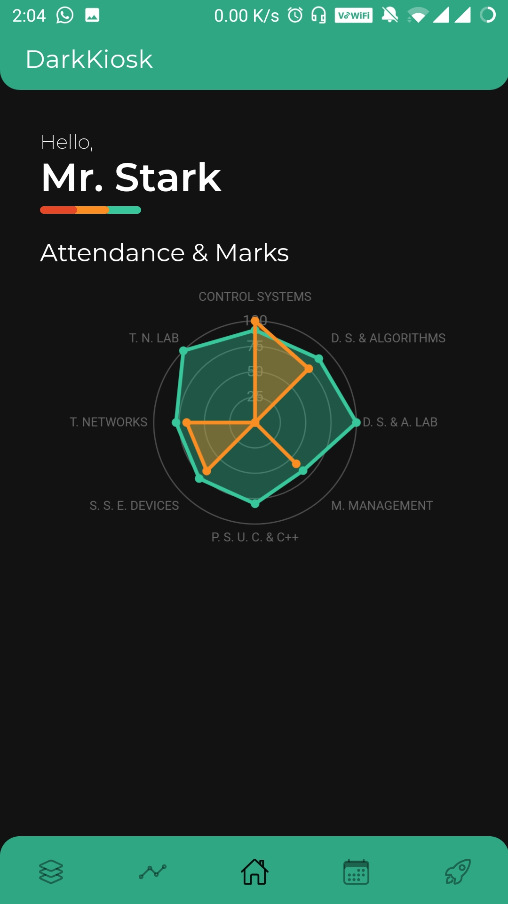
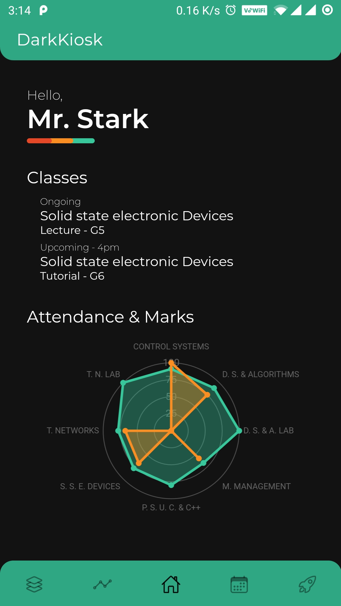
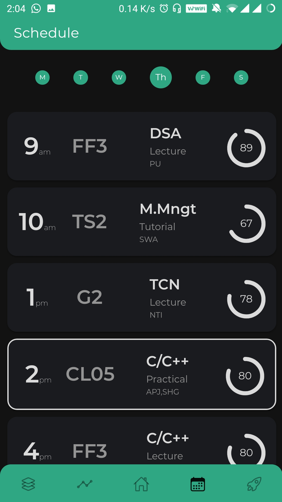
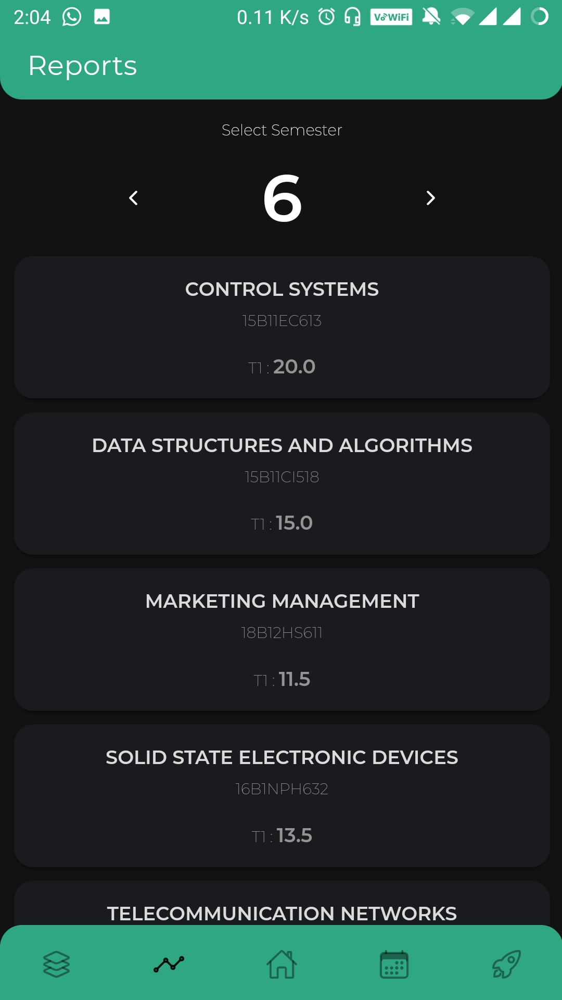
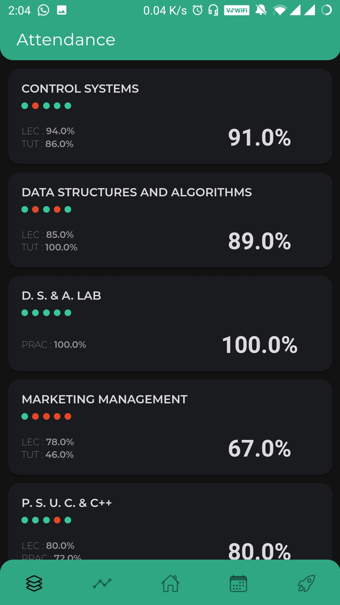
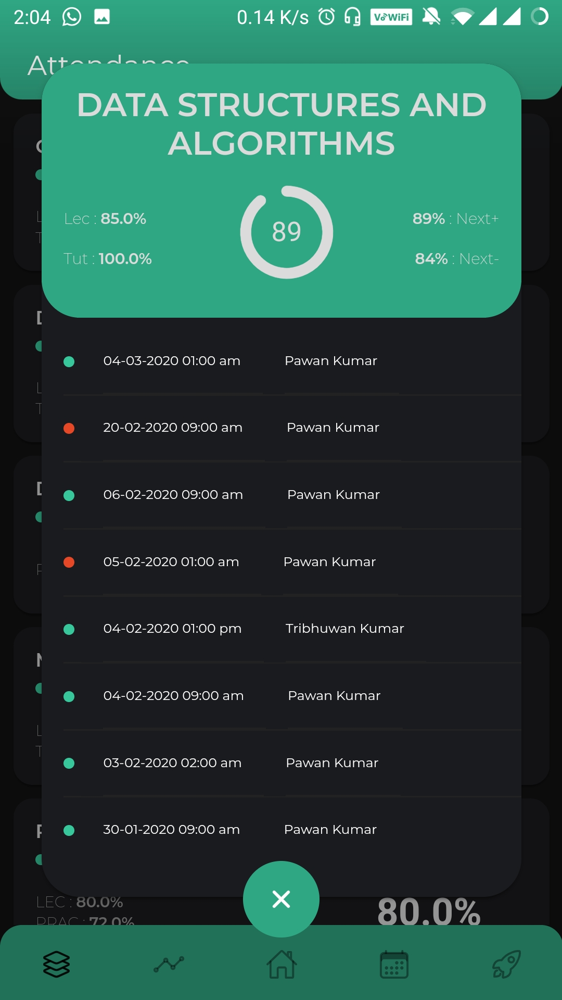

# DarkKiosk App for JIIT 62 Students

This app was build to manage and combine all info that a students need for day-to-day life jiit62 for example: webkiosk data, building timetable automatically from subjects retreived from webkiosk, editing timetable etc etc.

But as the scale and complexity of app grew, I was not able to update the app for public use and app is currently deprecated

### Prerequisites

This app relies on DarkKiosk API (https://github.com/tanishqmanuja/DarkKiosk-API-Public) for retreiving Webkiosk data.

## Screenshots

### Homepage

### Homepage with classes

### Schedule/Timetable

### Reports

### Attedance

### Attendance Details
